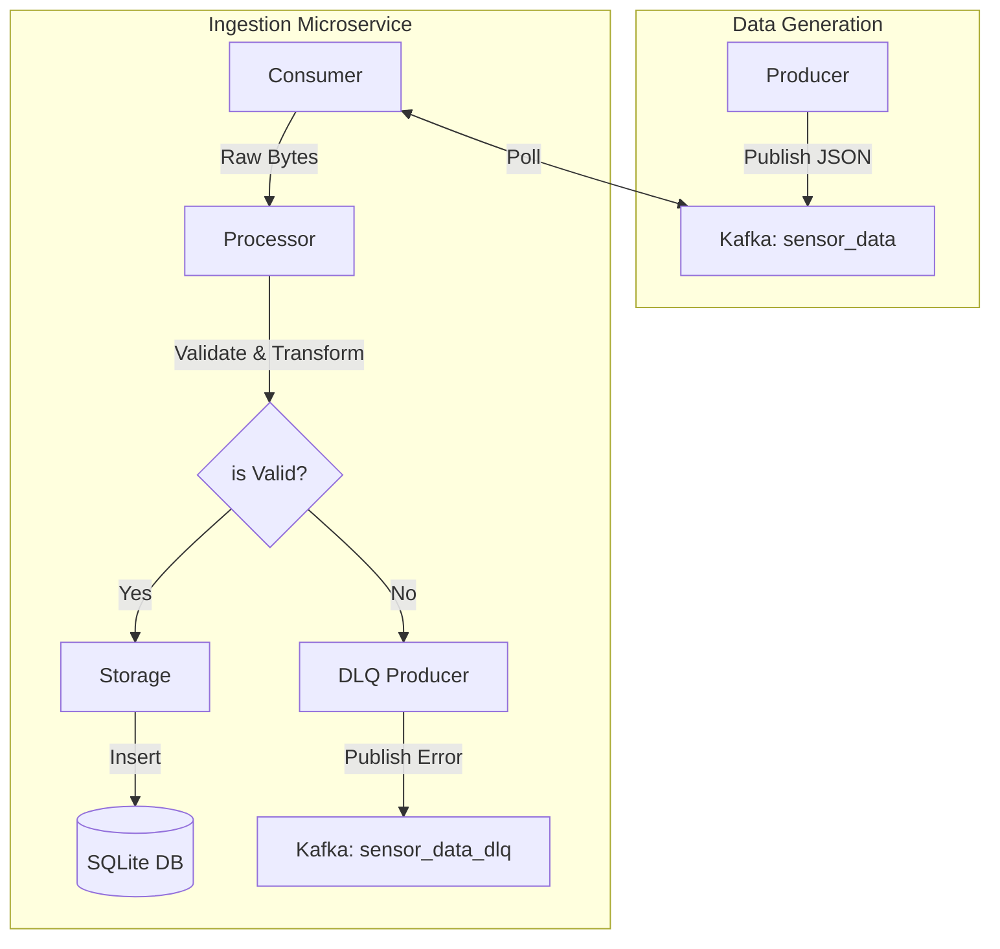

# Architecture Overview - Real-time Ingestion Service

This document describes the high-level architecture and data flow of the real-time ingestion microservice.

## System Components

- **Zookeeper**: Manages Kafka cluster state.
- **Kafka Broker**: The central message hub for sensor data.
- **Producer Service (Python)**: Generates synthetic sensor data and publishes to the `sensor_data` topic.
- **Ingestion Service (Python)**: 
    - **Consumer**: Polls messages from `sensor_data`.
    - **Processor**: Validates schema and transforms data.
    - **Storage**: Persists valid data to SQLite.
    - **DLQ Producer**: Sends invalid/failed messages to `sensor_data_dlq`.
- **SQLite DB**: Local persistent storage for processed readings.

## Data Flow Diagram

## Key Design Decisions

1. **Dead Letter Queue (DLQ)**: To ensure no data is lost and to facilitate debugging, messages that fail validation are not just dropped but sent to a separate Kafka topic.
2. **Modular Design**: Separation of concerns between Kafka handling, business logic (processing), and persistence (storage) makes the codebase testable and maintainable.
3. **Structured Logging**: Facilitates observability and troubleshooting in containerized environments.
4. **Graceful Shutdown**: Handlers for `SIGINT` and `SIGTERM` ensure that Kafka offsets are committed and database connections are closed properly during restarts.
